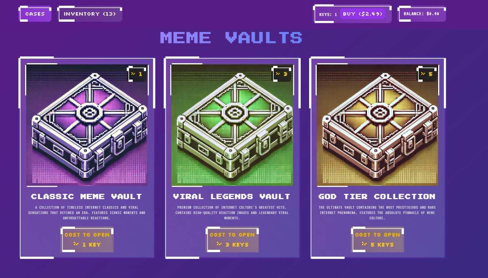

# 🎲 MemeCase Simulator

<div align="center">

### 🌟 Where Memes Meet Gaming Economy! 🌟

A retro-styled meme case opening simulator with pixel-perfect UI and smooth animations. Open different vaults using keys to collect rare memes! Features authentic CS:GO-style case spinning, pixelated design, and CRT effects. Built with React + TypeScript. Try your luck! 🎰✨

<kbd>
  
</kbd>

[](https://github.com/Dappzy/memecase-simulator/stargazers)
[](https://github.com/Dappzy/memecase-simulator/blob/main/LICENSE)
[](https://reactjs.org/)
[](https://www.typescriptlang.org/)
[](https://tailwindcss.com/)

[View Demo](https://github.com/Dappzy/memecase-simulator) · 
[Report Bug](https://github.com/Dappzy/memecase-simulator/issues) · 
[Request Feature](https://github.com/Dappzy/memecase-simulator/issues)

</div>

## 🎮 Current Features

- 🎲 Three unique meme vaults:
  - 📦 Classic Meme Vault (1 key)
  - 🌟 Viral Legends Vault (3 keys)
  - 👑 God Tier Collection (5 keys)
- 🎯 Authentic case opening experience with smooth animations
- 🖼️ Retro pixel art theme:
  - 📺 CRT scanline effect
  - ✨ Glowing pixel borders
  - 🎨 Custom pixel fonts
- 💎 Inventory system
- 🔑 Key management
- 🎨 Modern UI with retro aesthetics

## 🚀 Vision

We're building more than just a case opening simulator - we're creating a full meme-based gaming economy! Our vision includes:

- 🪙 Integration with memecoin for a real economic system
- 💱 Trading and marketplace for meme collectibles
- 🔄 Fusion system to combine memes and create rare ones
- 🎲 PvP games where players can bet their meme collections
- 🏆 Competitive tournaments and rankings
- 🌐 Community-driven meme submissions

## 📝 Project Roadmap

### 🌱 Phase 1: Foundation (Current)
- [x] Basic case opening system
- [x] Inventory management
- [x] Retro UI design
- [ ] Sound effects and music
- [ ] Local progress saving
- [ ] More case animations

### 💫 Phase 2: Economy Update
- [ ] Memecoin integration
- [ ] Meme rarity system
- [ ] Trading between users
- [ ] Marketplace implementation
- [ ] Meme fusion mechanics
- [ ] Achievement system

### 🎮 Phase 3: Gaming Features
- [ ] PvP meme battles
- [ ] Betting system
- [ ] Tournament system
- [ ] Seasonal events
- [ ] Custom game modes
- [ ] Leaderboards

### 🌟 Phase 4: Community & Beyond
- [ ] User-submitted memes
- [ ] Community voting system
- [ ] Custom case creator
- [ ] Mobile support
- [ ] Social features
- [ ] API for developers

## 🚀 Quick Start

1. Clone the repository:
```bash
git clone https://github.com/Dappzy/memecase-simulator.git
cd memecase-simulator
```

2. Install dependencies:
```bash
npm install
```

3. Start the development server:
```bash
npm run dev
```

4. Open [http://localhost:5173](http://localhost:5173) in your browser

## 🤝 Contributing

We love contributions! Whether you're fixing bugs, adding features, or improving documentation, your help is welcome. Here's how you can contribute:

### 🛠️ Development
- Fork the repo
- Create your feature branch
- Commit your changes
- Push to your branch
- Open a Pull Request

### 🎨 Design
- UI/UX improvements
- Pixel art contributions
- Animation enhancements
- Theme variations

### 💡 Ideas
- Suggest new features
- Share game mechanics
- Propose meme categories
- Design economic models

### 📚 Documentation
- Improve README
- Add code comments
- Create guides
- Write documentation

## 📜 License

Distributed under the MIT License. See `LICENSE` for more information.

## 🙌 Acknowledgments

- Inspired by CS:GO case opening mechanics
- Built with modern web technologies
- Amazing open-source community
- Pixel art and retro gaming community

---

<div align="center">

Made with ❤️ by [Dappzy](https://github.com/Dappzy)

### Join us in building the future of meme gaming! 🚀

⭐ Star this repo if you like what you see!

</div>
